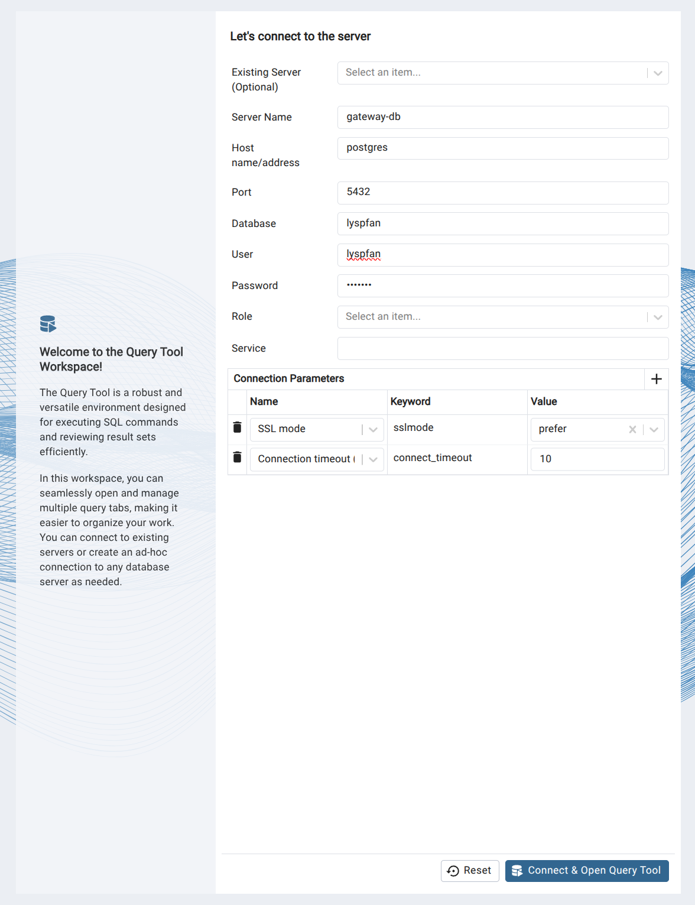

# Gateway routers scan analysis

Set up environment:
```bash
python3 -m venv venv
source venv/bin/activate
pip install -r requirements.txt
```

Start services:
```bash
docker compose up
```

Connect to PSQL from terminal:
```bash
./connect.sh
```

Connect to database GUI (pgadmin) from browser:
```bash
./pgadmin.sh
```

To connect to the server:


Set auto-fill password:
```bash
echo "localhost:6789:*:lyspfan:lyspfan" > ~/.pgpass
chmod 600 ~/.pgpass
```

DB:
- Database name is `lyspfan`
- Table names are `main`, `pfx2as`, `asfields`, `orgfields`

## Import data

> Probe data in hard drive are mounted on `/mnt/usb`. So far, we have three files with data: `combined-48s-r1-s56.csv.bz2`, `combined-48s-r2-s60.csv.bz2`, `combined-48s-r3-s64.csv.bz2`.

Decompress:
```bash
nohup ./decompress.sh &
```

Split files into smaller chunks for later processing:
```bash
nohup ./split.sh & 
```

Load data into database:
```bash
python3 load.py --full
```

Import CAIDA's pfx2as dataset:
- [Link to all datasets](https://publicdata.caida.org/datasets/routing/routeviews6-prefix2as/)
- Here we use `routeviews-rv6-20250730-0600.pfx2as`
```bash
./import/pfx2as.sh
```

Import CAIDA's as2org dataset: 
- Here we use `20250801.as-org2info.txt`
```bash
./import/as2org.sh
```

## Analyze data

Create a materialized view on all the duplicated HostID (with the NetID and SubnetPrefix they come from):
```bash

```